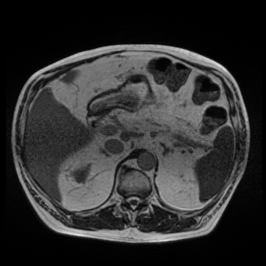
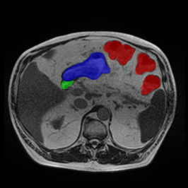

# UW-Madison GI Tract Segmentation (MONAI 3D)

Baseline code for the **UW-Madison GI Tract Image Segmentation** task (Kaggle-style dataset), using a MONAI **3D U-Net** with:
- full-volume validation via sliding-window inference
- Kaggle-style RLE CSV export for inference
- TensorBoard logging (always) + optional MLflow tracking

**Task**: given a 3D volume assembled from 2D grayscale PNG slices (`case_day`), predict **multi-label** binary masks for:
`large_bowel`, `small_bowel`, and `stomach`. Inference exports a Kaggle-style RLE CSV with one row per `(case_day, slice, class)`.

Repo layout:
- `configs/`: tracked YAML configs (release keeps only `train_unet3d.yaml` and `infer_unet3d.yaml`)
- `scripts/`: training and inference entrypoints
- `src/`: dataset utilities, RLE encode/decode, and model constants
- `docs/`: detailed documentation (baseline + MLflow)

## Setup

Recommended: Python 3.10+ with PyTorch + MONAI.

Install dependencies (example; adjust CUDA/PyTorch to your system):
```bash
pip install torch monai opencv-python pandas numpy pyyaml accelerate tensorboard
```

Optional (MLflow tracking):
```bash
pip install mlflow
```

Optional (GPU utilization metrics via NVML):
```bash
pip install pynvml
```

## Data

Expected dataset layout under `data_root` (default: `inputs/`):
```
inputs/
  train.csv
  train/
    caseXXX/
      caseXXX_dayY/
        scans/
          *.png
  splits/
    train_case_days.csv
    val_case_days.csv
    val_vis_samples.json  (optional)
```

- Split files are CSV with a `case_day` header and one `case_day` per row.
- `train.csv` is the Kaggle schema: `id,class,segmentation` (RLE may be empty for negatives).

## Training

Edit `configs/train_unet3d.yaml`, then:
```bash
python scripts/train_unet3d.py --config configs/train_unet3d.yaml
```

Detailed baseline documentation: `docs/TRAINING_BASELINE.md`.

Which config is used?
- `python scripts/train_unet3d.py --config <CONFIG>.yaml` uses the YAML you pass in.
- If you run `python scripts/train_unet3d.py` without args, it defaults to `configs/train_unet3d.yaml`.

Notes:
- Baseline model is MONAI `Unet` (3D, multi-label with sigmoid).
- `mixed_precision` can be `no`, `fp16`, or `bf16` (requires `accelerate`).
- TensorBoard logs are written to `outputs/<run>/tb/`.
- You can provide explicit train/val splits via `train_ids` and `val_ids` (CSV with `case_day` header).
- MLflow params/metrics/artifacts (including TensorBoard logs) are logged if `use_mlflow: true` (see `docs/MLFLOW.md`).
  - By default, the tracking backend uses `mlflow.db` when present (or `$MLFLOW_TRACKING_URI` if set).
  - Start UI with:
```bash
mlflow ui --backend-store-uri sqlite:///$(pwd)/mlflow.db --host 0.0.0.0 --port 5000
```

TensorBoard:
```bash
tensorboard --logdir outputs --port 6006 --host 0.0.0.0
```

## Resume training (checkpoint + MLflow resume)

This repo writes:
- `best.pt` when validation improves
- `last.pt` every epoch

To resume:
- Set `resume_from` to a previous run’s `last.pt` (also restores optimizer + scheduler).
- To resume in-place (write back into the same folder), also set `output_dir` to that run directory.

Example snippet:
```yaml
output_dir: "outputs/<run_name>"
resume_from: "outputs/<run_name>/last.pt"
```

## Outputs

Training run folder (default `outputs/<timestamp>_<model_name>/`):
- `best.pt`, `last.pt`
- `train.log`
- `tb/` (TensorBoard event files)
- When `use_mlflow: true`: `mlflow_run_id.txt` (+ optional `git/` artifacts if dirty is allowed)

Inference output folder (controlled by `output_dir` in `configs/infer_unet3d.yaml`):
- `submit.csv` (Kaggle-style RLE CSV)
- If `evaluate: true`: `eval_per_case.csv`, `eval_summary.json`
- `infer_summary.json` + resolved config dumps

## Inference (submission)

Edit `configs/infer_unet3d.yaml`, then:
```bash
python scripts/infer_unet3d.py --config configs/infer_unet3d.yaml
```

Notes:
- Produces a Kaggle-style RLE CSV (`submit.csv` by default) under `output_dir`.
- If `evaluate: true`, it also computes Dice on the split by decoding GT masks from `train_csv` and writes:
  - `eval_per_case.csv`
  - `eval_summary.json`
- Current inference script builds its slice index from `data_root/train/`, so `ids_csv` must refer to `case_day` entries that exist under that folder (e.g. val inference on the training set).

## Validation (visualization)

During training, the baseline can log a fixed set of val slice visualizations to TensorBoard (raw / GT / prediction):
- `val_vis_every` (0 disables)
- `val_vis_samples` (JSON containing `case_day` + `slice_pos`)

Helper script to generate sample lists:
```bash
python scripts/make_vis_samples.py --help
```

## Example (raw / GT / prediction)

Qualitative validation example for `case122_day27`, `slice_069` at training step `1000`:

| Raw | Ground truth (GT) | Prediction |
| --- | --- | --- |
|  |  |  |

Overlay colors (channels in `src/constants.py` order):
- Red: `large_bowel`
- Green: `small_bowel`
- Blue: `stomach`

## Docs

- Training baseline details: `docs/TRAINING_BASELINE.md`
- MLflow tracking details: `docs/MLFLOW.md`
